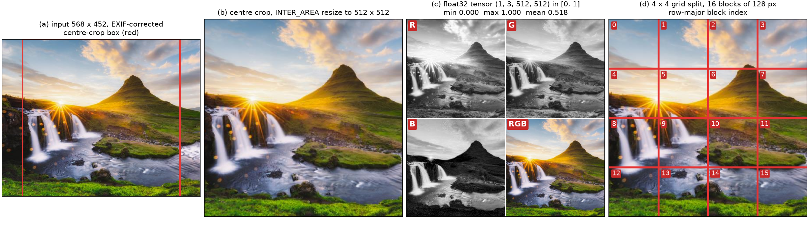

# 5. Experiments: setup

This chapter fixes everything that every later experiment depends on: the images
the system is evaluated on, how those images are prepared before painting, the
hardware the numbers are measured on, and the rules that make a run reproducible.
Results themselves appear in Chapter 6.

## 5.1 Input handling and preprocessing

### 5.1.1 What the module has to do

The proposal (section 3.1) asks for three things from the input stage: load a JPG
or PNG file or pick a supplied sample image, crop and resize it, and normalize it.
The painting pipeline adds two more requirements. The canvas is square, because
the neural renderer emits square patches of 128 or 32 pixels, so a non-square photo
has to be reconciled with a square canvas. And the image has to be split into an
`m x m` grid of blocks, because the optimizer works on one block at a time.

The module `core/image_io.py` covers the first three, `core/grid.py` the last.

### 5.1.2 Representation

One convention is used everywhere, which removes a whole class of silent bugs that
the reference implementation is prone to:

| Stage | Type | Shape | Range | Channel order |
| :--- | :--- | :--- | :--- | :--- |
| On disk | JPG / PNG, 8 bit | - | 0 to 255 | as stored |
| In memory (NumPy) | `float32` | `(H, W, 3)` | `[0, 1]` | RGB |
| On the device (PyTorch) | `float32` | `(1, 3, H, W)` | `[0, 1]` | RGB |
| Grid blocks | `float32` | `(m * m, 3, s, s)` | `[0, 1]` | RGB |

The reference implementation loads with OpenCV, which returns BGR, and converts to
RGB at the call site; the conversion is then easy to forget or to apply twice. Here
the loader is the only place that knows about channel order, and everything
downstream is RGB. Loading also applies the EXIF orientation tag, so a photo taken
in portrait orientation on a phone is painted the way it is displayed, and drops an
alpha channel or expands a grey-scale image to three channels. Files that are not a
supported raster format, that cannot be decoded, or that exceed a pixel budget are
rejected with a typed exception rather than an obscure failure deeper in the
pipeline, which is what the web interface needs in order to show a useful message.

### 5.1.3 Reconciling the aspect ratio with a square canvas

Three policies are implemented, selected by the caller:

| Mode | What it does | Cost |
| :--- | :--- | :--- |
| `stretch` | resize straight to the target, ignoring the aspect ratio | geometric distortion: circles become ellipses, brush strokes inherit the distortion |
| `crop` | centre-crop to the target aspect ratio, then resize | loses the border of the image |
| `pad` | letterbox to the target aspect ratio, then resize | adds empty border area that the optimizer still spends strokes on |

The reference implementation only offers `stretch` (`cv2.resize` to
`out_size * m_grid` in both directions). This is a real problem for evaluation
rather than a matter of taste: at a 4:3 aspect ratio, a stretch applies a 33 per
cent horizontal scale difference, so a stroke that is round in parameter space is
rendered as an ellipse, and the measured fidelity of a brush becomes a function of
the input's aspect ratio. This project uses `crop` as the default, and the frozen
evaluation set (section 5.2) is cropped to square once and stored that way, so that
the choice of mode cannot influence any reported number. Resampling uses
`INTER_AREA`, the same kernel as the reference implementation, which is the
appropriate choice for downscaling.

Figure 5.1 shows the four stages on one image of the evaluation set.

**Figure 5.1.** Preprocessing. (a) the input photograph with the centre-crop box in
red; (b) the crop resized to 512 x 512 with `INTER_AREA`; (c) the resulting float
tensor, shown as its three channels plus the recomposed image, with the value range
printed; (d) the 4 x 4 grid split with the row-major block indices used throughout
the code. Produced by `scripts/make_preprocessing_figure.py`.

### 5.1.4 Grid splitting

`core/grid.py` splits a `(B, C, H, W)` tensor into `(B * m * m, C, H/m, W/m)` blocks
and merges them back. Block `k` is at row `k // m` and column `k % m`; this
row-major order is the one the reference implementation assumes in its coordinate
transform, and keeping it lets the pretrained renderers and the published stroke
files be reused without reinterpretation. The split is a reshape and a permutation,
so it costs nothing and gradients pass through it, which matters because the
optimizer's loss is computed on blocks while the canvas is assembled from them.

The second function of the module is the coordinate transform. Strokes are
optimized in block-local coordinates, where the block spans `[0, 1]^2`; to draw them
on the whole image their positions and sizes have to be rescaled. For block `k` at
row `r` and column `c`:

$$x_{\text{global}} = \frac{c}{m} + \frac{x_{\text{block}}}{m}, \qquad
  y_{\text{global}} = \frac{r}{m} + \frac{y_{\text{block}}}{m}, \qquad
  \text{size}_{\text{global}} = \frac{\text{size}_{\text{block}}}{m}.$$

Bezier control points are stored relative to the chord between the two end points,
so they are dimensionless and are left untouched. This transform is verified
against the reference implementation for all four brushes and several grid sizes in
`tests/test_grid.py`, since an error here would displace every stroke and would be
easy to mistake for a bad optimizer.

### 5.1.5 Verification

The preprocessing and grid code is covered by unit tests: a PNG round trip is exact
to the 8-bit quantization, EXIF rotation is applied, grey-scale and RGBA inputs are
normalized to RGB, each resize mode produces the expected shape and crop box, the
split and merge are mutually inverse, block ordering matches hand-computed indices,
and the coordinate transform matches the reference implementation numerically.

## 5.2 Evaluation image set

### 5.2.1 Composition

The set is frozen once and never changed afterwards, so that every table in this
report is computed on identical pixels. It has two parts. The first is the eleven
images distributed with the reference implementation, which makes the comparison
against the original system direct and lets a reader reproduce it from a public
source. They already span a useful range of content: single objects on plain
backgrounds, faces, landscapes, high-frequency texture, and flat regions with sharp
edges. The second part is a set of self-collected photographs covering portraits,
landscapes, still life and high-texture scenes, which tests the system on material
the reference implementation was never tuned on.

Every image is centre-cropped to a square and resized to 512 x 512 with
`INTER_AREA`, then written as a lossless PNG. Storing the set already preprocessed
means the painter reads the pixels it will be measured on, with no resampling in
between, and that the original implementation and this one see byte-identical input.
The full listing, with source resolutions, crop boxes and SHA-256 hashes, is
`experiments/dataset.md`; the machine-readable manifest is
`data/eval_set/manifest.csv`. The set is rebuilt by `scripts/freeze_dataset.py`,
which refuses to overwrite an existing manifest unless explicitly forced.

### 5.2.2 Why 512 pixels

512 x 512 is the canvas size used by the reference implementation's demos, so
baseline numbers transfer. It is also the largest size at which a full progressive
run stays under a minute on the GPU profile, which makes the stroke-budget sweep
(four budgets, four brushes, three seeds) affordable. Resolution is not a variable
in any experiment: it is fixed here so that quality differences are attributable to
the loss, the grid strategy, the stroke budget or the brush, and not to scale.

## 5.3 Hardware and software profiles

Three profiles are used throughout, recorded in full in `experiments/hardware.md`:

| Profile | Device | Machine | Role |
| :--- | :--- | :--- | :--- |
| `cuda` | NVIDIA RTX 3070, 8 GB | desktop, Intel i5-13400F, 32 GB | renderer training, long optimization runs, headline GPU numbers |
| `mps` | Apple M4 GPU (Metal) | MacBook, 16 GB unified | development, interface work, Apple Silicon numbers |
| `cpu` | Intel i5-13400F (and Apple M4 as a second data point) | both | CPU numbers |

Every table states which profile produced it. A device is selected explicitly
rather than by an implicit fallback chain: requesting a backend that is unavailable
raises an error instead of silently running somewhere else, which is what keeps a
row from being labelled `cuda` when it in fact ran on the CPU.

## 5.4 Reproducibility rules

These rules apply to every run reported in Chapter 6.

1. **Seeds are fixed.** Stroke initialization, block shuffling and parameter
   initialization all draw from seeded generators. Headline numbers are reported as
   the mean and standard deviation over three seeds.
2. **Each run writes its own folder** under `experiments/`, containing the
   configuration, a results CSV, the final image, the stroke parameter file, and a
   log recording the device, the library versions and the git commit hash. Existing
   folders are never overwritten.
3. **Both machines run the same commit**, and the commit hash is recorded in every
   result row, so a number can always be traced back to the code that produced it.
4. **Checkpoints and frame dumps are not committed**; they are regenerated from the
   recorded configuration when needed.

## 5.5 Metrics

| Metric | What it measures | Implementation |
| :--- | :--- | :--- |
| PSNR | pixel fidelity to the target | computed on the 512 x 512 result |
| SSIM | structural similarity | `scikit-image` |
| LPIPS | perceptual similarity | `lpips` package, AlexNet backbone |
| Sinkhorn distance | distributional distance between canvas and target | this project's own implementation |
| Renderer PSNR against the rasterizer | how faithfully the neural renderer imitates the ground-truth rasterizer | held-out random strokes |
| Strokes to reach a PSNR threshold | stroke efficiency | logged per run |
| Wall time, peak memory | cost | measured with device synchronization |
| Aesthetic score (1 to 5) | human preference | survey, at least ten raters |

Pixel metrics are reported alongside LPIPS deliberately. A stroke-based painting is
a deliberate abstraction of its target, so PSNR alone rewards the wrong thing: a
system that reproduces the photograph exactly would score best while failing the
actual objective. PSNR and SSIM are used to compare configurations of the same
system against each other, LPIPS to check that gains are perceptually real, and the
survey to check that they are visible to people.
