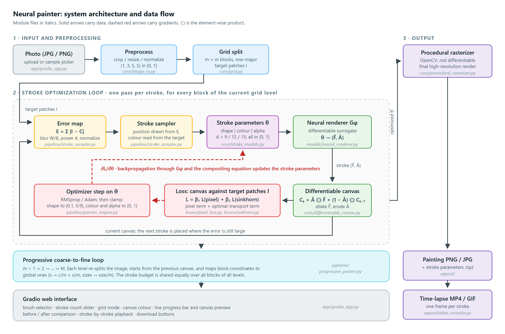
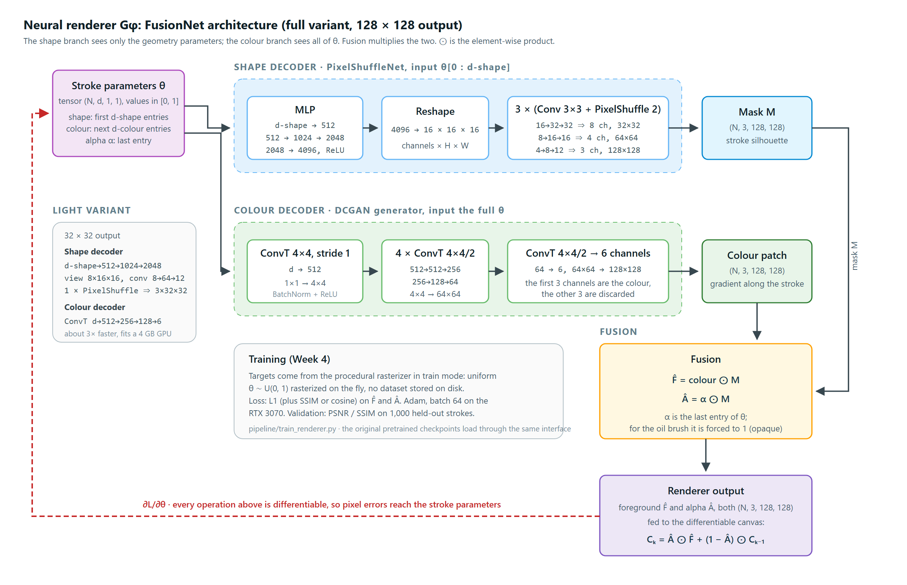
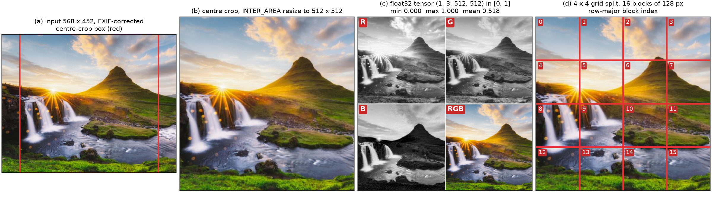

# Progress Report: Weeks 1 to 3

**Project:** Xây dựng hệ thống tái tạo tranh nghệ thuật từ ảnh thực tế bằng kỹ thuật cọ vẽ khả vi
(Photo-to-painting with a differentiable neural renderer)
**Student:** Nguyễn Lê Hoàng (24020003), class 24CSE, VNUK, University of Danang
**Supervisor:** Nguyễn Văn Thọ
**Reporting period:** 2026-09-05 to 2026-09-18 (Weeks 1 to 3 of 10)
**Date:** 2026-09-18

---

## 1. Summary

The first three weeks of the ten-week plan covered the literature review, the theory,
the system architecture and the image-input stage of the pipeline. By the end of the
period, 35 of the 39 planned items for these weeks were complete, which is 27 per cent
of the whole project.

The main results are:

1. **The original system has been reproduced on all three hardware profiles.** The
   2021 Stylized Neural Painting code needed five patches to run on current software
   (PyTorch 2.11 and 2.14, OpenCV 5, Apple Silicon). It then painted the reference
   image with all four brushes on an NVIDIA RTX 3070 (`cuda`) and an Intel
   i5-13400F (`cpu`), and with the oil brush on an Apple M4 (`mps` and `cpu`). These
   ten runs are the "original implementation" reference rows for every later
   comparison.
2. **The core of the new `neural_painter` package is implemented and tested.** It
   includes image loading and preprocessing, typed stroke models for the four
   brushes, the grid splitter, and a procedural rasterizer that produces the same
   pixels as the original. The suite has 81 automated tests, all passing on the
   desktop.
3. **The evaluation image set is frozen** at 512 x 512 pixels with a SHA-256
   manifest, so every later table is computed on identical input.
4. **About 21,000 words of report material are drafted:** the theory chapter, the
   experiments-setup chapter, an annotated bibliography, a related-work outline, a
   method skeleton for the paper and notes on the original source code.

Three items are still open. Two of them need action from the student: submitting the
corrected proposal and adding self-collected photographs to the evaluation set.
Section 6 lists all three.

## 2. Scope of the period

The period follows Weeks 1 to 3 of the schedule in `RESEARCH_PLAN.md`, section 4:

| Week | Title | Planned outcome |
| :--- | :--- | :--- |
| 1 | Literature review and proposal finalization | working baseline on every machine, bibliography, corrected proposal |
| 2 | Theory and system architecture | package skeleton, architecture diagrams, theory draft of at least 8 pages |
| 3 | Image input and preprocessing module | preprocessing, stroke models, rasterizer and grid code with tests; frozen dataset |

Table 1 shows the status of each week, counted from the checkboxes in `ROADMAP.md`.

**Table 1.** Completion by week.

| Week | Items | Done | Completion |
| :--- | ---: | ---: | ---: |
| Week 1 | 17 | 14 | 82% |
| Week 2 | 11 | 11 | 100% |
| Week 3 | 11 | 10 | 91% |
| **Weeks 1 to 3** | **39** | **35** | **90%** |

## 3. Work completed

### 3.1 Week 1: environment, baseline reproduction and literature

#### 3.1.1 Development environments

Work is split between two machines. The desktop does training and benchmarking, and
the MacBook does day-to-day development and Apple Silicon measurements. Both are
recorded in full in `experiments/hardware.md`.

**Table 2.** Hardware and software profiles.

| Profile | Machine | Device | Python | PyTorch |
| :--- | :--- | :--- | :--- | :--- |
| `cuda` | Desktop, Windows 11, 32 GB RAM | NVIDIA RTX 3070, 8 GB VRAM, CUDA 12.8 | 3.11.9 | 2.11.0+cu128 |
| `cpu` | Same desktop, GPU hidden | Intel i5-13400F, 10 cores / 16 threads | 3.11.9 | 2.11.0 |
| `mps` | MacBook, macOS, 16 GB unified memory | Apple M4 GPU (Metal) | 3.14.4 | 2.14.0 |
| `cpu` (second point) | Same MacBook | Apple M4 CPU | 3.14.4 | 2.14.0 |

All eight pretrained renderer checkpoints from the original project are downloaded:
the full and lightweight variants for oil paint, watercolour, marker pen and
coloured tape.

#### 3.1.2 Making the 2021 code run on current software

The reference implementation was written for a 2020 PyTorch and CUDA stack. It
needed five changes before it would run. These changes are kept as a single diff,
`experiments/original_repo_modern_torch.patch`, so the baseline can be rebuilt from
a clean checkout:

1. **Checkpoint loading.** PyTorch 2.6 changed `torch.load` to `weights_only=True`
   by default. The 2020 checkpoints pickle a NumPy scalar, so loading failed.
2. **Device mapping.** Checkpoints are now loaded to the CPU and then moved to the
   target device. The original code branched on `torch.cuda.is_available()`, which
   excludes Apple's MPS back end.
3. **Device selection.** The code now tries CUDA, then MPS, then CPU, in
   `painter.py`, `networks.py` and `demo_prog.py`.
4. **OpenCV 5 colour arguments.** OpenCV 5 rejects NumPy `float32` scalars as
   colours in `cv2.circle` and `cv2.fillPoly`. This broke the watercolour, marker pen
   and tape rasterizers. The oil brush draws through `warpAffine` and was not
   affected, which is why the first MacBook run (oil only) did not show the problem.
   The pixel-parity test described in section 3.3.2 found it.
5. **Seeding.** A `--seed` flag was added that seeds Python, NumPy and PyTorch.
   Without it, stroke initialization and block shuffling are random, and no result
   can be reproduced.

#### 3.1.3 Baseline measurements

Every run used the same protocol: the `apple` test image, a 512-pixel canvas, 500
strokes, the lightweight renderer, pixel loss only, a progressive grid from
$1 \times 1$ to $5 \times 5$, and seed 0. The canvas colour follows the authors'
demos: white for oil paint and watercolour, black for marker pen and tape. Wall
time covers the whole process, including model loading and the final render of 500
frames.

**Table 3.** Baseline of the original implementation (seed 0, 500 strokes).
Desktop rows come from `experiments/2026-09-16_week1_baseline_desktop/`. MacBook rows
are from 2026-09-05 and predate the seed flag.

| Profile | Machine | Brush | Wall time (s) | Final loss | PSNR* (dB) |
| :--- | :--- | :--- | ---: | ---: | ---: |
| `cuda` | RTX 3070 | oil paint | 71.4 | 0.0506 | 22.04 |
| `cuda` | RTX 3070 | marker pen | 56.4 | 0.1386 | 14.02 |
| `cuda` | RTX 3070 | watercolour | 63.2 | 0.0490 | 22.45 |
| `cuda` | RTX 3070 | coloured tape | 60.2 | 0.0463 | 22.71 |
| `cpu` | i5-13400F | oil paint | 185.2 | 0.0512 | 22.00 |
| `cpu` | i5-13400F | marker pen | 168.4 | 0.1710 | 11.96 |
| `cpu` | i5-13400F | watercolour | 178.3 | 0.0492 | 22.43 |
| `cpu` | i5-13400F | coloured tape | 173.9 | 0.0466 | 22.74 |
| `mps` | Apple M4 | oil paint | 118.4 | 0.0503 | 22.24 |
| `cpu` | Apple M4 | oil paint | 252.3 | 0.0498 | 22.20 |

\* The original code reports this number as `step_acc`. It is the PSNR between the
canvas and the target, but it is measured on the blocks of the final grid level,
not on the finished 512-pixel image. It is used here only to compare runs of the
same code with each other. Chapter 6 will report PSNR, SSIM and LPIPS on the
finished image.

**Table 4.** Device speed-ups on the oil brush.

| Comparison | Speed-up |
| :--- | ---: |
| RTX 3070 over the i5-13400F CPU | 2.6x |
| Apple M4 GPU over the Apple M4 CPU | 2.1x |
| RTX 3070 over the Apple M4 GPU | 1.7x |

Section 4 discusses these results.

#### 3.1.4 Literature and proposal

- **Annotated bibliography** (`report/bibliography.md`): 20 entries. It runs from
  classical stroke-based rendering (Haeberli 1990, Litwinowicz 1997, Hertzmann 1998),
  through learned painting agents and differentiable renderers (Learning to Paint,
  Neural Painters, Paint Transformer), to optimal transport (Cuturi 2013) and
  perceptual metrics (SSIM, LPIPS). Each entry says which report chapter will cite
  it. Details that still need checking against the publisher are marked "[verify]".
- **Related-work outline** (`report/related_work_outline.md`): five subsections and
  a positioning paragraph. The paragraph states the gap this project addresses: the
  original work has no ablation of the Sinkhorn weight or the grid strategy across
  brush materials, no cross-platform support and no interactive interface.
- **Proposal corrections** (`report/proposal_corrections.md`): Section 4.1 of the
  proposal still contains template text (Java or C, Swing or JavaFX). It is rewritten
  in Vietnamese with an English translation to describe the actual system: Python,
  PyTorch 2.x and a Gradio web interface on CUDA, MPS and CPU. Six other places in
  the proposal that conflict with the project plan are listed with one-line
  replacements.

### 3.2 Week 2: theory and system architecture

#### 3.2.1 Package skeleton and brush configurations

The `neural_painter/` package was created with the layout from the engineering
design, installable with `pip install -e .` from a root `pyproject.toml`. Each brush
is described once, in a YAML file, and every module reads its parameter layout from
there (Table 5). Each parameter vector has three parts: shape, colour and opacity.

**Table 5.** Stroke parameter layouts. All parameters lie in $[0, 1]$.

| Brush | Config file | Dimension | Shape / colour / opacity |
| :--- | :--- | :---: | :---: |
| Oil paint | `oil_brush.yaml` | 12 | 5 / 6 / 1 |
| Watercolour | `watercolor.yaml` | 15 | 8 / 6 / 1 |
| Marker pen | `marker_pen.yaml` | 12 | 8 / 3 / 1 |
| Coloured tape | `tape.yaml` | 9 | 5 / 3 / 1 |

Modules for later weeks (the neural renderer, the renderer trainer, the Sinkhorn
loss, the stroke sampler, the painter engine, the progressive painter, export and
the web app) exist as stubs. Each stub documents its planned interface, so every
later week starts from a written contract. Three small modules were implemented
early because each is under 50 lines: the pixel loss, differentiable morphology and
the alpha-compositing canvas.

#### 3.2.2 Architecture diagrams

**Figure 1.** System architecture: the optimization loop, the package modules and
the data flow between them (`report/figures/system_architecture.svg`).

**Figure 2.** The dual-pathway neural renderer: a shape decoder produces the alpha
mask $\hat{A}$, a colour decoder produces the foreground $\hat{F}$, and the two are
fused (`report/figures/renderer_architecture.svg`).

#### 3.2.3 Study of the original code

Before re-implementing the original code, each of its source files was read and
summarized in a one-page note (`report/notes/original_code/`): `renderer.py`,
`networks.py`, `loss.py`, `pytorch_batch_sinkhorn.py`, `painter.py` together with
the two demo scripts, and `utils.py`. Each note covers purpose, key functions, data
flow, quirks and technical debt, and what changes in the new package. Reading the
code closely also turned up issues outside the five patches. One example: the VGG
loss uses a deprecated `torchvision` call, which has to be replaced before the
style-transfer stretch goal in Week 9.

#### 3.2.4 Theory chapter and method skeleton

- **Chapter 2, Theoretical Background** (`report/chapters/02_theory.md`, about 7,200
  words, sections 2.1 to 2.9). It covers stroke-based rendering, the four stroke
  parameterizations, procedural rasterization, and the compositing equation

  $$C_k = \hat{A}_k \odot \hat{F}_k + (1 - \hat{A}_k) \odot C_{k-1}.$$

  It then covers the neural renderer as a differentiable surrogate and the pixel
  loss. The optimal transport section goes from Monge and Kantorovich to the
  entropic Sinkhorn algorithm and includes a one-dimensional worked example. The
  chapter ends with the style loss, error-map stroke initialization, the progressive
  grid schedule and a notation table. At more than the required 8 pages, it meets
  the Week 2 exit criterion.
- **Paper method skeleton** (`report/paper/method_skeleton.md`): sections 3.1 to 3.6
  of the planned paper, with the figures and tables each section will contain.

### 3.3 Week 3: image input, stroke models and rasterizer

#### 3.3.1 Modules

**Table 6.** Core modules implemented in Week 3.

| Module | Lines | Function |
| :--- | ---: | :--- |
| `core/image_io.py` | 252 | Loads JPG/PNG with EXIF orientation, sample picker, crop, three resize modes (stretch, crop, pad), normalization to RGB `float32` in $[0, 1]$, tensor conversion, typed errors for invalid input |
| `core/stroke_models.py` | 419 | `BrushSpec` loaded from YAML, typed stroke dataclasses, bounds validation and clipping |
| `core/procedural_rasterizer.py` | 422 | Port of the original OpenCV rasterizer for all four brushes, brush-texture loading, seeded random stroke sampling |
| `core/grid.py` | 176 | Splits an image into an $m \times m$ grid of blocks and merges it back, maps block coordinates to global coordinates, progressive schedule helper |
| `core/device.py` | 81 | Explicit choice of `cuda`, `mps` or `cpu`; asking for a device that is not available raises an error instead of silently falling back |

One data representation is used throughout: RGB `float32` arrays in $[0, 1]$, shaped
`(H, W, 3)` in NumPy and `(1, 3, H, W)` as tensors. The original code mixes BGR and
RGB. Here, channel order is handled only in the loader.

#### 3.3.2 Verification

The test suite (`tests/`) has 81 tests in five files, and all pass on the desktop.
The most important is the **pixel-parity test** of the rasterizer. The pretrained
renderers were trained to imitate the original rasterizer, so the new rasterizer
must match it exactly if those checkpoints are to be reused and compared fairly in
Week 4. For each brush, the test renders 25 random strokes at 32 and 128 pixels, in
both training and inference modes, with both implementations. It also renders a
40-stroke canvas sequence and the oil-brush texture warp. Every output must be
identical pixel for pixel. This test also found the OpenCV 5 incompatibility
described in section 3.1.2.

The other tests cover:

- an exact PNG round trip;
- EXIF rotation;
- conversion of grey-scale and RGBA input to RGB;
- the output shape and crop box of each resize mode;
- that split and merge undo each other;
- block ordering;
- the block-to-global coordinate mapping, checked against the original code for
  all four brushes;
- a test that every module in the package imports.

#### 3.3.3 Frozen evaluation set

The evaluation set is stored in `data/eval_set/` and was generated by
`scripts/freeze_dataset.py`. It currently holds the 11 test images supplied with
the original project. They cover single objects on plain backgrounds, a face,
landscapes, high-frequency texture, and flat regions with sharp edges. Each image
is centre-cropped to a square, resized to 512 x 512 with `INTER_AREA`, and stored as
a lossless PNG. The manifest records each image's source size, crop box and SHA-256
hash. Because the images are stored already preprocessed, the original
implementation and the new one read identical pixels. The resize the original code
performs becomes the identity, and the aspect-ratio policy cannot affect any
reported number.

#### 3.3.4 Experiments-setup chapter

**Chapter 5, Experiments: setup** (`report/chapters/05_experiments_setup.md`, about
1,800 words) describes:

- input handling and the three aspect-ratio policies;
- grid splitting and the coordinate transform;
- the evaluation set;
- the hardware profiles;
- the reproducibility rules;
- the metrics.

Its Figure 5.1 shows the preprocessing stages on one image of the set (Figure 3).

**Figure 3.** Preprocessing on one image: (a) the input with the crop box,
(b) the 512 x 512 crop, (c) the normalized tensor channels, (d) the 4 x 4 grid split
with block indices.

## 4. Findings so far

**The GPU gives only a modest speed-up.** The RTX 3070 is only 2.6 times faster
than the desktop CPU. Each optimization step updates a few hundred stroke
parameters through a small network. Tensors this small cannot keep a GPU busy, so
run time depends mostly on the fixed overhead of each step rather than on the GPU's
arithmetic speed. The final per-stroke frame render also runs on the CPU and costs
the same on every device. In practice, this means the system is usable without a
GPU, which matters for the web interface and the demo.

**Output quality does not depend on the device.** Oil paint reaches 22.0 to 22.2 dB
on all four profiles. The small differences come from the order of floating-point
operations, not from the algorithm.

**The marker pen is an outlier.** It reaches 14.0 dB on CUDA and 12.0 dB on the CPU,
against about 22 dB for the other brushes, and its loss is three to four times
higher. The marker paints flat, single-colour strokes on a black canvas, so it cannot
reproduce the smooth gradients that make up most of the apple photograph. It also
shows a 2 dB gap between devices, much larger than any other brush. This suggests
its runs have not fully converged and vary a lot from run to run. For this reason,
the marker pen stays in the Week 5 Sinkhorn ablation, where it is the brush most
likely to benefit.

**PSNR does not rank brushes the way a viewer would.** Coloured tape, the crudest
brush, has the highest PSNR (22.7 dB). This supports the plan to report LPIPS and an
aesthetic survey alongside the pixel metrics.

**Pixel-exact testing paid off early.** The parity test caught an incompatibility
that a visual check of the oil brush had missed. It also shows that the new
rasterizer can stand in for the original in every later comparison.

**Stretching distorts the fidelity measurement.** The original code only stretches
images to a square. At a 4:3 aspect ratio, that scales one axis by 33 per cent more
than the other, so round strokes come out as ellipses and a brush's measured
fidelity depends on the input's shape. Cropping is therefore the default in the new
package, and the evaluation set is stored already cropped.

## 5. Deviations from the plan

| Deviation | Reason | Effect |
| :--- | :--- | :--- |
| A fifth patch to the original code (OpenCV 5 colour arguments) | Not anticipated in the plan; found by the parity test | None on results; recorded in the patch file and in `experiments/week1_baseline.md` |
| `pyproject.toml`, `tests/` and `scripts/` sit at the repository root instead of inside the package | Standard Python layout, so that `pip install -e .` works | Layout differs from `PLAN.md` section 3; noted in `experiments/week_02.md` |
| Pixel loss, morphology and compositing canvas implemented in Week 2 instead of Weeks 4 and 5 | Each is under 50 lines | Less work later; they are still tested in the week that uses them |
| MacBook baseline rows are unseeded | They were run before the `--seed` flag existed | Kept as a record; later comparisons cite the seeded desktop rows |
| The only quality number the original code reports is a block-level PSNR | This is how the original code measures quality | Baseline quality is comparable only between runs of the same code; proper metrics come in Chapter 6 |

## 6. Open items and issues

**Open items from Weeks 1 to 3**

1. **Self-collected photographs** (student action). Add 10 to 20 photographs of
   portraits, landscapes, still life and high-texture scenes, then rerun the freeze
   script with `--force`. The 11 existing images will be regenerated byte for byte,
   so their hashes stay valid. This has to happen before the Week 5 ablations, after
   which the set is closed. Note that the script reads from `data/raw_photos/`. The
   MacBook currently has an empty folder named `data/own_photos/`, which the script
   ignores.
2. **Proposal submission** (student action). Apply the corrections in
   `report/proposal_corrections.md` to the proposal and submit it.
3. **Cross-machine check.** The MacBook has pulled the current commit (`66decc2`)
   from the remote, so the git sync works in practice. The roadmap item is not
   ticked yet. Two things remain. First, run the test suite on `mps`; the MacBook
   virtual environment does not have `pytest` installed yet. Second, rerun the
   MacBook baseline with `--seed 0` so that all profiles share one protocol.

**Issue found while writing this report.** The baseline CSVs, the baseline note and
the dataset record give their code version as commit `c9d0528`. That commit is not
in the repository history; the result files arrived in commit `03bf6c8`. The history
was probably rewritten before it was pushed. Before these rows are cited in the
report, the recorded hash should be updated to a commit that exists, or the baseline
should be rerun at a known commit. Otherwise the traceability rule in section 5.4 of
Chapter 5 is broken.

## 7. Plan for the next period (Week 4)

Week 4 builds the differentiable renderer for the oil brush and produces the first
result for research question RQ4: can a re-implemented renderer match the original?

- `models/neural_renderer.py`: the FusionNet-style renderer, plus an adapter that
  loads the original `zou-fusion-net` checkpoints behind the same interface.
- `pipeline/train_renderer.py`: training on synthetic strokes generated on the fly
  by the verified procedural rasterizer.
- `tests/test_renderer.py`: single-stroke render, output range, and a gradient check
  comparing finite differences with autograd.
- Train the oil renderer on the RTX 3070 (batch size 64, halved if memory runs
  out), with a short `mps` smoke test on the MacBook.
- **Measurement:** PSNR and SSIM of the new renderer and of the original checkpoint
  against the procedural rasterizer on 1,000 held-out random strokes. The target is
  to beat the original or come within 1 dB of it.

The Week 3 rasterizer work directly enables this. Its exact match with the original
means that the training data for the new renderer, and the reference both renderers
are measured against, are the same as those the original checkpoints were trained
on.

## 8. Deliverables produced in this period

| Type | Location |
| :--- | :--- |
| Patch to the original code | `experiments/original_repo_modern_torch.patch` |
| Baseline results (10 rows) | `experiments/week1_baseline.md`, `experiments/2026-09-16_week1_baseline_desktop/` |
| Hardware profiles | `experiments/hardware.md` |
| Frozen evaluation set and manifest | `data/eval_set/`, `experiments/dataset.md` |
| Package core and configurations | `neural_painter/core/`, `neural_painter/configs/` |
| Test suite (81 tests) | `tests/` |
| Scripts | `scripts/run_original_baselines.sh`, `freeze_dataset.py`, `make_preprocessing_figure.py`, `svg_to_png.sh`, `roadmap_progress.py` |
| Figures | `report/figures/system_architecture`, `renderer_architecture`, `preprocessing_pipeline` (SVG and PNG) |
| Report chapters | `report/chapters/02_theory.md`, `report/chapters/05_experiments_setup.md` |
| Supporting writing | `report/bibliography.md`, `report/related_work_outline.md`, `report/proposal_corrections.md`, `report/paper/method_skeleton.md`, `report/notes/original_code/` |
